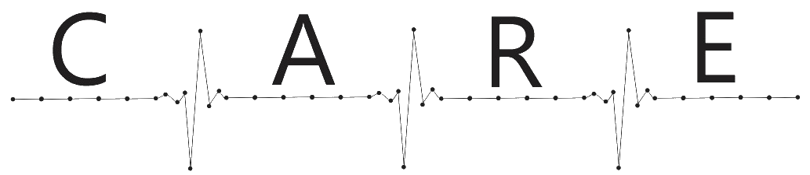

<h1 align="center">
    
</h1>

<h4 align="center"> 
	C.A.R.E Blockchain - Concluído 🔨
</h4

## 💻 Sobre o projeto

O C.A.R.E Blockchain é uma projeto que visa auxiliar a distribuição de medicamentos de alto custo entre postos da rede pública de saúde brasileira de forma assertiva e rastreável, para melhorar o processo de distribuição como um todo, garantindo uma maior disponibilidade para o consumidor.

Projeto foi desenvolvido durante o trabalho de conclusão de curso (TCC) da [FACULDADE DE TECNOLOGIA TERMOMECANICA (FTT)](http://ftt.com.br/home/) no curso de Engenharia de Computação.

---

## ⚙️ Como Funciona

1. O medicamento de alto
custo chega da indústria
farmacêutica ao centro de
distribuição cadastrado na
C. A. R. E.
   - Cada caixa de medicamento possuirá
um adesivo NFC que será utilizado para
identificar e auxiliar no monitoramento
e rastreabilidade do medicamento

2. Um funcionário do centro de
distribuição irá
registrar a chegada do
medicamento por meio de
um aplicativo desenvolvido
pela C. A. R. E. previamente
instalado em um celular para
ler o adesivo NFC
   - Aqui será registrado o primeiro
bloco de informações desse
medicamento no sistema. Ele terá
informações de data
e local de chegada do medicamento
em questão.

3. Assim que definido para qual
unidade de saúde o
medicamento de alto custo
será enviado, um funcionário
realizará novamente a
leitura do adesivo NFC de
cada caixinha por meio do
aplicativo, informando o
local de destino do mesmo
   - Aqui um segundo bloco é criado.
Nele estarão disponíveis informações
de data de saída, local atual do
remédio e
local de destino pretendido.

4. Ao chegar no posto de saúde,
um funcionário
realiza a leitura do adesivo
NFC por meio do aplicativo
para registrar sua
chegada.
   - O terceiro registro do ciclo de vida do
medicamento de alto custo nasce neste
momento dentro do sistema da C. A. R. E.
Nele são registradas data de chegada
do medicamento e local.

5. Neste momento, em um outro
aplicativo
desenvolvido pela C. A. R. E., o
usuário final, ou seja, o cidadão
que pretende
ir retirar o medicamento de alto
custo no posto de distribuição,
consegue verificar
em quais unidades de
distribuição o medicamento que
necessita está disponível.
   - No aplicativo também é possível
verificar outras informações, como
endereço e telefone do posto de
distribuição.

6. Ao fazer a retirada do
medicamento de alto
custo, o funcionário do posto
de distribuição realiza a
leitura do adesivo NFC
mais uma vez para registrar a
saída do medicamento,
finalizando o ciclo de vida
do mesmo na cadeia de
distribuição.
   - Nesse momento o quarto e último registro
do medicamento é realizado no sistema,
contendo as informações de data de saída
do posto de distribuição, CPF do usuário final e
Registro Médico (RM) do médico
que receitou o medicamento ao paciente.

---

## 🚀 Como executar o projeto

💡Para o funcionamento do C.A.R.E Blockchain é necessário que o [Helix Sandbox NG](https://github.com/Helix-Platform/Sandbox-NG) esteja sendo executado e federado.

### Pré-requisitos

Antes de começar, você vai precisar ter instalado em sua máquina a seguinte ferramenta:
[Docker](https://www.docker.com/).

### Configurações

Para fazer a configuração do serviço da blockchain, é necessário editar as variaveis de ambiente qe se encontram no [docker-compose.yml](https://github.com/matheus-maria/Blockchain/blob/master/docker-compose.yml), sendo elas:

- **ConnString** : Conexão ao banco de dados da blockchain (MongoDB).
- **Difficulty** : Dificuldade da cadeia da blockchain.
- **MonitoringTime** : Inverlado de tempo entre cada validação da blockchain.
- **HelixUrl** : Url do Helix Sandbox NG.
- **HelixEntity** : Entidade do Helix Sandbox NG.
- **Blockchain** : Url para obtenção de outra blockchain em funcionamento, caso a blockchain atual seja corrompida.

#### 🎲 Rodando o Blockchain (servidor)

```bash
# Clone este repositório
$ git clone git@github.com:matheus-maria/Blockchain.git

# Acesse a pasta do projeto no terminal/cmd
$ cd Blockchain

# Verifique se o docker está rodando

# Inicie o programa
$ docker-compose up -d

# O servidor inciará na porta:8080 - acesse http://localhost:8080/api/getBlocks
```

---

## 🛠 Tecnologias

As seguintes ferramentas foram usadas na construção do projeto:

#### [](https://github.com/tgmarinho/Ecoleta#server-nodejs--typescript)**Blockchain**  ([NodeJS](https://nodejs.org/en/)  +  [TypeScript](https://www.typescriptlang.org/))

- **[Express](https://expressjs.com/)**
- **[CORS](https://expressjs.com/en/resources/middleware/cors.html)**
- **[Mongoose](https://www.npmjs.com/package/mongoose)**
- **[Crypto-js](https://www.npmjs.com/package/crypto-js)**
- **[Request](https://www.npmjs.com/package/request)**
- **[Require-dir](https://www.npmjs.com/package/require-dir)**
- **[Util](https://www.npmjs.com/package/util)**
- **[Typescript](https://www.npmjs.com/package/typescript)**
- **[Sucrase](https://www.npmjs.com/package/sucrase)**

> Veja o arquivo  [package.json](https://github.com/matheus-maria/Blockchain/blob/master/package.json)

#### [](https://github.com/tgmarinho/Ecoleta#utilit%C3%A1rios)**Utilitários**

- Protótipo:  **[Adobe XD](https://www.adobe.com/br/products/xd.html)**
- Editor:  **[Visual Studio Code](https://code.visualstudio.com/)**
- Markdown:  **[StackEdit](https://stackedit.io/)**,  **[Markdown Emoji](https://gist.github.com/rxaviers/7360908)**
- Teste de API:  **[Postman](https://www.postman.com/)**

---

## 👨‍💻 Contribuidores

Time responsavel pelo desenvolvimento da solução do C.A.R.E Blockchain

<table>
  <tr>
    <td align="center"><a href="https://www.linkedin.com/in/matheus-maria/"><br /><sub><b>Matheus Augusto Maria</b></sub></a><br /></td>
    <td align="center"><a href="https://www.linkedin.com/in/bruno-castellani/"><br /><sub><b>Bruno Castellani Caña</b></sub></a><br /></td>
    <td align="center"><a href="https://www.linkedin.com/in/mariarsilveira/"><br /><sub><b>Maria de Fátima Rocha Silveira</b></sub></a><br /></td> 
  </tr>

  <tr>
    <td align="center"><a href="https://www.linkedin.com/in/gustavo-antonio-ferreira-74282b110/"><br /><sub><b>Gustavo Antonio Ferreira</b></sub></a><br /></td>
    <td align="center"><a href="https://www.linkedin.com/in/fabio-cabrini/"><br /><sub><b>Fábio Henrique Cabrini
</b></sub></a><br /></td>
<td align="center"><a href="https://www.linkedin.com/in/gabriel-lara-baptista/"><br /><sub><b>Gabriel Lara Baptista
</b></sub></a><br /></td>
    
  </tr>
  
</table>

## 💪 Como contribuir para o projeto

1. Faça um **fork** do projeto.
2. Crie uma nova branch com as suas alterações: `git checkout -b my-feature`
3. Salve as alterações e crie uma mensagem de commit contando o que você fez: `git commit -m "feature: My new feature"`
4. Envie as suas alterações: `git push origin my-feature`
> Caso tenha alguma dúvida confira este [guia de como contribuir no GitHub](./CONTRIBUTING.md)

---

## 🦸 Autor

<a href="https://github.com/matheus-maria">
 
 <br />
 <sub><b>Matheus Augusto Maria</b></sub></a> <a href="https://github.com/matheus-maria" title="Rocketseat">🚀</a>
 <br />

[](https://www.linkedin.com/in/matheus-maria/)
[](mailto:mmatheus.maria@gmail.com)

---

## 📝 Licença

Este projeto esta sobe a licença [MIT](./LICENSE).

Feito por Matheus Augusto Maria 👋🏽 [Entre em contato!](https://www.linkedin.com/in/matheus-maria/)